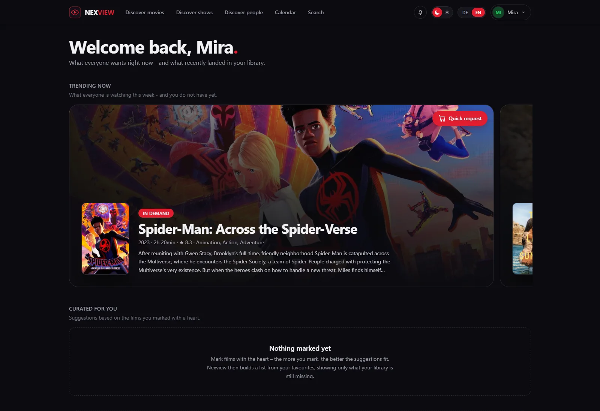
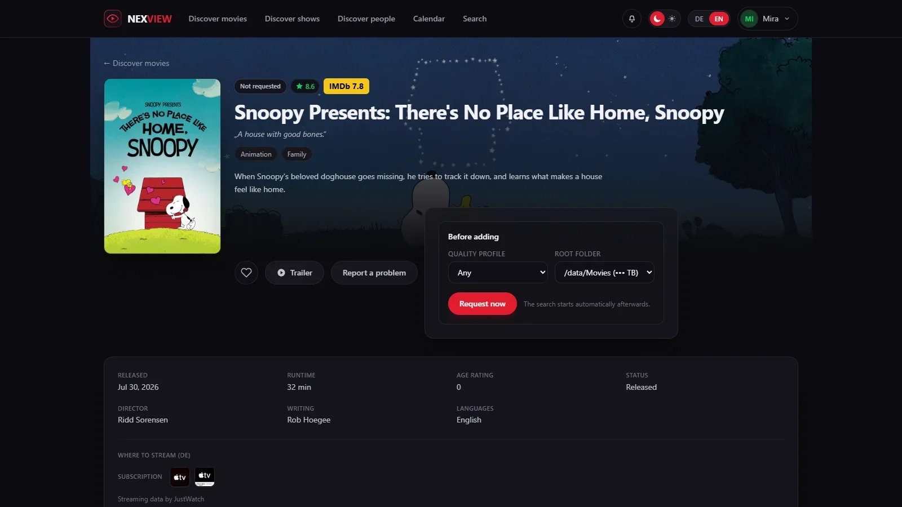
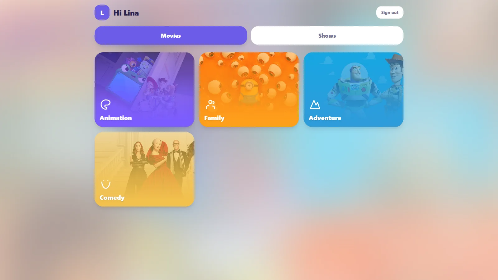

<div align="center">


# Nexview

**Find something to watch — and request it straight from Radarr and Sonarr.**

[Project site](https://nexview.nexapps.dev) · [Changelog](CHANGELOG.md) · [Report an issue](https://github.com/DerKezorm/nexview/issues/new)

</div>

Nexview is a self-hosted media discovery dashboard for a household — family, flatmates,
a circle of friends. It shows new releases from [TMDB](https://www.themoviedb.org/),
marks what is already in your library, and hands requests to **Radarr** (movies) and
**Sonarr** (shows). Everyone gets their own account, with roles, approvals and quotas.

It downloads nothing itself and stores no media. It is the front door to a setup you
already run — it does not replace any part of it.

Without a TMDB key Nexview starts with sample data, so you can look around before
deciding anything.

---

<div align="center">



<sub>The home page. What each person marks as a favourite shapes what they get suggested.</sub>

<br><br>




<sub>Requesting a title, and the same installation seen by a child.</sub>

</div>

**The full tour is on the [project site](https://nexview.nexapps.dev)** — every area with
its own page and more screenshots.

---

## What it does

**Finding something**

- Separate areas for movies and shows, each with its own logic
- Filter by period, language, region, genre, rating and studio; cards or list
- Detail pages with cast photos, directing and writing credits, studios, keywords,
  similar titles and the trailer in a window
- Ratings from IMDb, Rotten Tomatoes and Metacritic on the title itself
- Where a title is currently streaming in your region, split into subscription, free,
  rent and buy (data from JustWatch)
- Browse people — actors, directors, writers — and mark them as favourites; your
  favourites, titles and people alike, shape what gets suggested on your home page
- A release calendar, one week at a time: your own titles kept apart from new releases,
  with cinema and digital dates read for your region

**Requesting**

- Pick quality profile and target folder, or let the approver pick them instead
- Request whole shows or single seasons, optionally following future ones
- Optionally a second Radarr and Sonarr instance for 4K: the same title once in 1080p
  and once in 4K, with separate folders, profiles and per-user permissions
- The state sits on the poster — not requested, requested, searching, already
  downloaded, in library, blocked — and updates itself as Radarr and Sonarr work

**Who may do what**

- Three roles: administrator, approver, user. An approver decides on requests without
  ever getting near your API keys
- Approve automatically or by hand, set separately for movies, shows and 4K
- Quotas per day, week or month — or, instead of counting titles, **by disk space in
  gigabytes**, which is the thing that actually runs out
- Child accounts: a parent creates a login for their child, with an age, a set of
  categories and a language. The child gets a separate, simpler app and does not
  request but *wishes* — nothing happens until the parent approves, and the request
  then runs in the parent's name
- A block list for titles that should stay out: visible, but not requestable
- Sign in through **Authentik, Keycloak, Pocket ID, Google** or any other OpenID Connect
  provider — added alongside the password, never replacing it

**With a media server**

Plex is optional. Connect one and four things arrive:

- Sign in with a Plex account, checked against your server — no second password
- Titles already in the library are recognised even if they never came through
  Radarr or Sonarr, and cannot be requested twice
- Your Plex watchlist appears inside the catalogue, requestable with one click.
  Nothing happens on its own; every title takes a click
- What each person has already watched carries a marker. Everyone sees their own;
  an administrator sees who watched what, under *Statistics & analysis → Watching*
- Live playback across every connected server: who is watching what, on which device,
  and whether the server is transcoding the video for it — the one that costs CPU

**Staying informed**

- A bell in the app, and per-event e-mail if you want it
- Seven notification channels for the installation as a whole: ntfy, Gotify, Telegram,
  Discord, a plain webhook, [Apprise](https://github.com/caronc/apprise) and e-mail.
  Each inbox picks its own events, language and urgency
- A ticket centre where people report problems and get an answer, with state and history
- Statistics and an error log for the administrator

**Running it**

- An **admin dashboard**: twenty background checks across services, disk, supply,
  library, source reconciliation and Nexview itself. Every finding says what follows
  from it, and its button lands on the page that fixes it
- **Statistics & analysis** in six tabs — including where Radarr, the media server and
  Nexview's own books disagree, which is where the errors nobody looks for live
- A **tile for Homepage or Homarr**: one call, ready-made snippets

**And**

- German and English throughout, including titles and descriptions
- A dark interface that works on a phone

## Built with

- **Frontend:** React 19, Vite, Tailwind CSS 4
- **Backend:** Python, FastAPI
- **Database:** SQLite — accounts, settings and requests only, never media files
- **Sessions:** JWT, passwords hashed with bcrypt
- **Deployment:** a single Docker container serving both the API and the interface

---

## Running with Docker

Nexview runs as **one** container: FastAPI serves the API and the built interface
together. No extra web server is needed.

The image is on the GitHub Container Registry and is built for Intel/AMD **and** ARM,
so nothing has to be compiled:

```bash
docker compose up -d
```

Nexview is then reachable at `http://<your-server>:5173`.

To build from source instead, replace `image: ghcr.io/derkezorm/nexview:latest` in
`docker-compose.yml` with `build: .` and add `--build` when starting.

### What to back up

Everything that matters lives in the directory mapped to `/data`:

| File | Contents |
|---|---|
| `nexview.db` | accounts, requests, feedback, settings |
| `secret.key` | the key your stored API keys are encrypted with |
| `avatars/` | profile pictures |
| `trash/` | the fetched TRaSH guides your quality profiles were built against |
| `logs/` | error log |

**`secret.key` belongs with the database.** Without it the stored TMDB, Radarr, Sonarr
and SMTP credentials cannot be decrypted. Back both up together — and never put that
backup in a public repository.

`trash/` matters for a subtler reason: each quality profile records which TRaSH snapshot
it was written against. Restore a database without it and Nexview measures those profiles
against a different snapshot, reporting drift on profiles nobody touched.

Nexview's own backups (*Settings → Backups*) already contain all of this — database, key,
avatars and TRaSH snapshot — in one encrypted archive. The list above is for backing up
the directory by hand.

### On a Synology

In **Container Manager** under *Project → Create*, pick the project folder and use the
`docker-compose.yml`. Two adjustments are worth making:

```yaml
    ports:
      - "5173:8000"        # change the left number if 5173 is taken
    volumes:
      - /volume1/docker/nexview/data:/data
```

A fixed path instead of `./data` makes backing up through Hyper Backup easier.

#### On host networking

With `network_mode: host` there is no port mapping — the port inside the container *is*
the port on your server, and if something already sits on 8000, Nexview will not come up.
`NEXVIEW_PORT` moves it:

```yaml
    network_mode: host
    environment:
      NEXVIEW_PORT: 8123
```

Everyone else can ignore this. Without the variable Nexview listens on 8000 as before, and
the left number in `ports:` is what you reach it at.

You do **not** need to sort out permissions on that folder — the container sets them on
start. If you want the files to belong to a particular user, put their numbers in
`PUID`/`PGID` (find them over SSH with `id username`).

### Updating

```bash
docker compose pull
docker compose up -d
```

The database is kept. Nexview brings it up to date itself on start: missing tables,
columns and indexes are added. **Before** anything is changed it writes a copy to
`/data/sicherungen/`, keeping the five most recent — so if something does go wrong, the
previous state is still there.

### Image tags

Nexview follows the usual `MAJOR.MINOR.PATCH` numbering:

| Image | Contents |
|---|---|
| `ghcr.io/derkezorm/nexview:latest` | the latest **released** version — the recommendation |
| `ghcr.io/derkezorm/nexview:0.20.0` | exactly that one version, never changes |
| `ghcr.io/derkezorm/nexview:main` | the current development state, may be broken |

The running version is in the footer and in detail under **About Nexview**, which also
reports when a newer one exists. For that it asks GitHub at most once a day. The check
sends nothing out of Nexview and can be switched off on the same page.

---

## Configuration

Every setting is optional — Nexview runs without a configuration file. For production,
copy `.env.example` to `.env`:

| Variable | Meaning |
|---|---|
| `NEXVIEW_SECRET_KEY` | Secret for sessions and for encrypting the API keys. Generated automatically and stored in `data/secret.key` if unset. |
| `NEXVIEW_DATA_DIR` | Directory for the database and key file (default: `./data`) |
| `NEXVIEW_ACCESS_TOKEN_MINUTES` | How long a sign-in stays valid (default: 30) |
| `NEXVIEW_REFRESH_TOKEN_DAYS` | How long you stay signed in (default: 30) |
| `NEXVIEW_CORS_ORIGINS` | Allowed origins in development |
| `NEXVIEW_STATIC_DIR` | Folder with the built frontend (the container sets this itself) |
| `NEXVIEW_LOG_LEVEL` | Overrides the log level chosen in the app (`quiet`, `normal`, `detailed`, `trace`). Emergency exit for when Nexview does not start. |
| `NEXVIEW_PORT` | Port Nexview listens on **inside the container** (default: 8000). Read by the container's start script, not by the backend itself. Only needed on host networking — see below. |
| `NEXVIEW_CLIENT_IP` | How Nexview learns the caller's address, for rate limiting sign-ins: unset (count per account only), `direct`, `proxy`, or `proxy:2`. See below. |
| `NEXVIEW_COOKIE_SECURE` | Whether the sign-in cookie is marked `Secure`: `auto` (default), `on`, or `off`. See below. |
| `NEXVIEW_URL_BASE` | Serve Nexview under a sub-path behind a reverse proxy, e.g. `/nexview` for `https://example.com/nexview/`. Unset means the root, exactly as before. See below. |
| `NEXVIEW_CSP` | Content security rules: `on` (default), `report-only`, or `off`. See below. |
| `NEXVIEW_FRAME_ANCESTORS` | Who may put Nexview in a frame: `none` (default), `self`, or an origin. See below. |
| `NEXVIEW_IMG_SOURCES` | Extra image hosts, space separated. Only needed if calendar posters stay blank. See below. |

**No TMDB, Radarr or Sonarr keys belong in `.env`** — you enter those in the app.

### Rate limiting sign-ins

After a few wrong passwords Nexview slows the next attempt down, and after ten it
closes the door for fifteen minutes. The lock **opens again by itself** — nobody has to
unlock anything. It covers signing in to Nexview, signing in with a media-server
password, and the links sent by mail.

Counting always happens **per account**, which needs no configuration. Counting per
address is extra, and it needs `NEXVIEW_CLIENT_IP`, because Nexview cannot tell on its
own whether it sits behind a reverse proxy:

| Value | When |
|---|---|
| unset | You are not sure. Only accounts are counted. **This is always safe.** |
| `direct` | Nexview is reachable directly, with no proxy in front |
| `proxy` | Exactly one reverse proxy in front (Nginx, Caddy, Nginx Proxy Manager, Traefik) |
| `proxy:2` | Two in front, for example Cloudflare and then your own |

> ⚠️ Leave it unset if you are unsure. Saying `direct` while a proxy sits in front makes
> every request look like it comes from the same address — one typo would then lock out
> the whole household, you included.

### The sign-in cookie

Your sign-in is kept in an `HttpOnly` cookie. The browser sends it back on its own, and
no script on the page can read it — which is the point: a script that gets onto the page
can no longer carry your sign-in away with it.

`NEXVIEW_COOKIE_SECURE` decides whether that cookie is marked `Secure`, meaning the
browser only ever sends it over HTTPS:

| Value | When |
|---|---|
| `auto` | Default. `Secure` is set whenever the request itself arrived over HTTPS. Works everywhere, including plain HTTP. |
| `on` | Always set it. Use this when a reverse proxy terminates HTTPS and forwards plain HTTP to Nexview — Nexview sees `http` and would leave it off. |
| `off` | Never set it. |

> ⚠️ Do not set `on` if Nexview is meant to be reachable over `http://`. A browser throws
> a `Secure` cookie away over plain HTTP, and nobody would be able to sign in.

Nexview deliberately does **not** guess from `X-Forwarded-Proto`: that header can be
faked just like `X-Forwarded-For`, and the same question is already answered by asking
rather than guessing over at `NEXVIEW_CLIENT_IP`.

### Signing in through an external provider

Nexview can hang off a sign-in service you already run — anything that speaks **OpenID
Connect**. Set it up under **Settings → System → Sign-in**; a button per provider then
appears on the sign-in page.

You need four things from your provider:

| Field | Where it comes from |
|---|---|
| **Issuer URL** | The base address of your provider. Nexview reads its `/.well-known/openid-configuration` itself, so you do not enter individual endpoints. |
| **Client ID** | Created when you register Nexview as an application. |
| **Client secret** | Same place. Leave empty only for a public client. |
| **Label** | What the button says: “Sign in with Authentik”. |

And your provider needs one thing from you — the **redirect URI**:

```
https://your-nexview/api/auth/oidc/<slug>/callback
```

The slug is what you chose when adding the provider; Nexview shows the finished address
on the settings page, ready to copy. Requested scopes are `openid email profile`.

> **⚠️ The public address has to be right.** The redirect URI is built from it, and a
> provider rejects anything that does not match its registration exactly. If you run
> Nexview under a sub-path, the address includes it.

**Existing accounts link from the profile**, under *Account → Sign-in*. Your password
keeps working — an external provider is added, it never replaces what is there.
**New people** can be created automatically if you switch that on; they get the role and
quota from your defaults. Leave it off and only people you have already invited can sign
in that way.

#### Authentik

*Applications → Providers → Create → OAuth2/OpenID Provider.* Set the redirect URI,
choose `Authorization code` flow, and take the **client ID and secret** from the
provider page. The issuer URL is
`https://authentik.example.com/application/o/<application-slug>/` — Authentik shows it
under the provider as *OpenID Configuration Issuer*.

#### Keycloak

*Clients → Create client*, type `OpenID Connect`. Switch **Client authentication** on
(otherwise there is no secret), enable `Standard flow`, and enter the redirect URI under
*Valid redirect URIs*. The issuer URL is
`https://keycloak.example.com/realms/<realm>`.

#### Pocket ID

*OIDC Clients → Add client.* Enter the redirect URI, copy client ID and secret. The
issuer URL is your Pocket ID address itself, e.g. `https://id.example.com`.

#### Google

*Google Cloud Console → APIs & Services → Credentials → Create credentials → OAuth
client ID*, type `Web application`. Add the redirect URI under *Authorised redirect
URIs*. The issuer URL is `https://accounts.google.com`.

> Google hands out an email address for every Google account in the world. Leave
> automatic account creation **off** unless you have restricted the OAuth client to your
> own workspace — otherwise anyone with a Google account can sign in.

### Behind a reverse proxy

With its own (sub)domain — `https://nexview.example.com` — Nexview needs no
configuration at all. To serve it under a **sub-path** of a shared domain instead,
set one variable and restart the container:

```
NEXVIEW_URL_BASE=/nexview
```

Now Nexview lives at `https://example.com/nexview/`. Any prefix works, `/tools/nexview`
too. Leave the variable unset and everything behaves exactly as before.

With the prefix set, Nexview answers **both** forms of address: with the prefix (for
proxies that pass the path through unchanged — the recommended setup) and without it
(for proxies that strip the prefix before forwarding, and for the container's own
health check). Whichever way your proxy is configured, it works.

**nginx**

```nginx
location /nexview {
    proxy_pass http://127.0.0.1:5173;
    proxy_set_header Host $host;
}
```

**Caddy**

```caddy
handle /nexview* {
    reverse_proxy 127.0.0.1:5173
}
```

`handle_path` (which strips the prefix) works just as well.

**Traefik** (labels on the Nexview container)

```yaml
- traefik.http.routers.nexview.rule=PathPrefix(`/nexview`)
- traefik.http.services.nexview.loadbalancer.server.port=8000
```

A `stripprefix` middleware works just as well.

**Nginx Proxy Manager**

On your proxy host, add a *Custom Location* `/nexview` and forward it to the host and
port Nexview listens on. No advanced configuration needed.

> ⚠️ **Set the public address with the prefix included.** The address under
> *Settings → Addresses* goes into every link Nexview sends — invitations, password
> resets. With a prefix it must read `https://example.com/nexview`. Nexview suggests it
> correctly and shows a warning when the prefix is missing, but it cannot stop you from
> saving without it.

### Content security rules

Nexview tells your browser where it may load things from, and where it may send things
to. Anything not on the list is refused. The one that matters most is that **no script
on the page can send data to any address other than Nexview's own** — which is exactly
the gap the sign-in cookie leaves open: the cookie stops a stolen pass being carried
away, not being used.

You should not need to touch any of this. Three switches exist for the cases where you
do:

| Variable | Values | When |
|---|---|---|
| `NEXVIEW_CSP` | `on` (default), `report-only`, `off` | `report-only` reports breaches in the browser console without blocking anything — useful to look before you commit. `off` turns the header off entirely. |
| `NEXVIEW_FRAME_ANCESTORS` | `none` (default), `self`, or an origin | Set this if you embed Nexview in a dashboard such as Organizr. Without it the frame stays **empty, with no error message**. |
| `NEXVIEW_IMG_SOURCES` | space separated origins | Set this if calendar posters stay blank. |

> ⚠️ **Why posters can stay blank.** Calendar posters are not built by Nexview — it
> passes on whatever address Radarr or Sonarr stored, and that depends on your metadata
> provider. The usual ones (TMDB, TheTVDB, fanart.tv) are allowed already. If yours is
> something else, the posters simply do not appear; the browser only says so in its
> console. `NEXVIEW_IMG_SOURCES=https://your.host` fixes it.

---

## The HTTP interface

Nexview has one HTTP interface, and the web interface uses it too. Anyone who can reach
your instance can call it — the endpoints themselves are protected, but the map is open:
the browsable documentation lives at `/docs`, the machine-readable version at
`/openapi.json`.

### API tokens

Scripts, dashboards and anything else that talks to Nexview without a browser use a
personal API token. You create one in **Profile → Account → Security**, and it is shown
exactly once — afterwards only a checksum remains, and not even an administrator can look
it up.

```bash
curl -H "Authorization: Bearer nxv_…" https://your-nexview/api/v1/requests/mine
```

**A token has exactly the rights of the account it belongs to** — no more. Role, quota,
approval and blocklist apply to it just as they apply to its owner, so a token belonging
to an ordinary account still goes through approval instead of around it. If you want a
service account with few rights, create a *user* with those rights and give it a token.

One switch on top: **may only read**. Such a token can fetch data but not create, change
or delete anything — right for dashboards and monitoring.

Tokens can carry an expiry date, the list shows when each was last used, and revoking one
takes effect immediately. Child accounts do not get tokens.

Administrators see every token in the installation under **Settings → System → API
tokens** — owner, name, age and last use. They can look, not revoke: only the owner
switches off their own token. Deactivating an account locks its tokens along with it.

### What is promised, and what is not

Fourteen endpoints live under **`/api/v1`**, and for those there is a promise: as long as
`v1` is in the address, nothing disappears from their answers. If something has to break,
`/api/v2` will appear beside it and v1 will keep running.

| | |
| --- | --- |
| `GET /api/v1/search/{media_type}` | find a title |
| `GET /api/v1/media/{media_type}/{tmdb_id}` | details for one |
| `POST /api/v1/requests` | request it |
| `GET /api/v1/requests/mine` | how your own requests are doing |
| `GET /api/v1/requests/quota` | how much you may still request |
| `POST /api/v1/requests/{id}/cancel` | withdraw one |
| `GET /api/v1/home/recent` | what was recently downloaded |
| `GET /api/v1/tickets/open-count` | open tickets |
| `GET /api/v1/admin/requests/pending/count` | requests waiting for approval |
| `GET /api/v1/notifications/unread/count` | unread notifications |
| `GET /api/v1/storage/me` | your own storage use |
| `GET /api/v1/about` | which version is running |
| `GET /api/v1/health` | whether it is up |
| `GET /api/v1/dashboard` | one tile for your home dashboard |

**Everything else under `/api/…` is an inside part of the application.** You may use it,
but it can change with any version — field names included. Nothing there is promised.

⚠️ `GET /api/v1/home/recent` also carries `requested_by` and `requester_avatar`. Putting
that on a dashboard shows **who asked for what**. In a household that is usually the point;
on a screen other people see, it may not be.

### A tile for Homepage or Homarr

`GET /api/v1/dashboard` answers with everything a tile needs in one call: how many findings
are open, what is waiting, how full the library is, and whether the instances are answering.
Ready-made snippets for both are in **[docs/dashboard-tile.md](docs/dashboard-tile.md)**.

⚠️ **That one needs a token belonging to an administrator.** Instance state and disk figures
are an operator's business, and a token inherits the rights of its owner. *May only read*
limits it to `GET`, but an administrator's read-only token can still read the user list, the
log and the settings — worth knowing before you pin it to a screen somebody else can see.

## Development

**Requirements:** Python 3.12+ and Node.js 20+

### Backend

```bash
cd backend
python -m venv .venv
.venv/Scripts/activate      # Linux/macOS: source .venv/bin/activate
pip install -r requirements-dev.txt
python -m uvicorn app.main:app --reload --port 8000
```

The API then runs on `http://127.0.0.1:8000`, with interactive documentation at
`http://127.0.0.1:8000/docs`.

### Frontend

In a second terminal:

```bash
cd frontend
npm install
npm run dev
```

The interface opens at `http://localhost:5173`. Requests to `/api` are forwarded to the
backend automatically.

### First run

A one-time wizard appears on first launch:

| Step | Required | For |
|---|---|---|
| Account | yes | administrator with username, e-mail address and password |
| Picture | no | profile picture — without one, Nexview shows initials |
| TMDB | no | titles, posters, descriptions. Without a key you get sample data |
| Radarr | no | movies. Without Radarr, movies cannot be requested |
| Sonarr | no | shows. Without Sonarr, no show requests |
| Address | **yes** | the address Nexview is reachable at; it goes into every link |
| E-mail | **yes** | SMTP server for invitations and password recovery |

The last two cannot be skipped, and *Continue* only unlocks after a successful
connection test. The reason: straight afterwards Nexview sends you a confirmation
mail — and **without a confirmed address you cannot get back in**. A mail server that
does not work would leave a fresh installation unusable.

If the confirmation never arrives, the sign-in page helps: with the right password it
offers **Resend confirmation** and **Correct address**, so a typo is not fatal.

**Further accounts come from invitations** — or through the media server. The
administrator sets only the address and the role; the invitee picks their own username,
display name and password through the link in the mail. Nobody else learns that
password, not even the administrator.

### Tests

The backend suite — the big one, and the one that has to be green before a
release:

```bash
cd backend
.venv/Scripts/python.exe -m pytest
```

The interface is tested on two levels. The fast ones run without a browser
against a replaced API layer, in seconds:

```bash
cd frontend
npm test
```

And one runs in a real Chromium, against a real server: it signs in, reloads,
and signs out again. That is the only way to prove that the browser really
keeps the sign-in across a reload — the session lives in a cookie that
JavaScript cannot read, so nothing below a real browser can tell you. It starts
backend and interface itself, on their own ports and on an empty database:

```bash
cd frontend
npx playwright install chromium   # once
npm run e2e
```

All three run in CI on every push and every pull request.

### Starting over

To discard all accounts and settings, delete the `data/` directory. The next start runs
the wizard again.

---

## Credits

Metadata comes from **TMDB**. This project is neither endorsed nor certified by TMDB.

Sign-in, library matching and the watched state run through **Plex**, when a server is
connected. Nexview is neither endorsed by nor affiliated with Plex.

Downloads are handled by **Radarr** and **Sonarr**; ratings come from **IMDb**,
**Rotten Tomatoes** and **Metacritic**, streaming availability from **JustWatch**.
Notifications can go through **ntfy**, **Gotify**, **Telegram**, **Discord**, a plain
webhook or **Apprise**.

Quality profiles, custom formats and the file naming scheme are built from the
**[TRaSH Guides](https://trash-guides.info)** (MIT). Nexview ships a snapshot of their
JSON data so the first setup works without internet access, and fetches newer versions
from [their repository](https://github.com/TRaSH-Guides/Guides) when you ask it to. The
scoring itself — which release is worth more than which, and why — is their work.

**[Seerr](https://seerr.dev)**, which grew out of Overseerr and Jellyseerr, was the
model: the idea of what a request interface for Radarr and Sonarr can look like comes
from there, from the second instance for 4K down to matching against the media server.
Nexview is an independent implementation and takes no source code from it, but owes it
a great deal.

---

## Licence

Nexview is under the **GNU Affero General Public License, version 3 or later**
(AGPL-3.0-or-later) — see [LICENSE](LICENSE). The source may be used, modified and
passed on, commercially too. What the AGPL asks in return: if you change Nexview and
let other people use your changed version — including over a network, without handing
out any files — you have to make your changed source available to them too. Running
Nexview unchanged asks nothing of you. There is no warranty.

**Versions up to and including 0.17.0 were released under the MIT licence.** That grant
is perpetual and is not being withdrawn — anyone who received those versions keeps them
under MIT. From 0.18.0 on, the AGPL applies.

The licence covers this project's source. It does not cover:

- **Metadata, posters and images from TMDB.** Those fall under the
  [TMDB terms of use](https://www.themoviedb.org/terms-of-use); running Nexview needs
  your own API key.
- **Plex, Radarr, Sonarr, Docker, Synology, IMDb, Rotten Tomatoes, Metacritic,
  JustWatch, ntfy, Gotify, Telegram, Discord and Apprise.** Trademarks of their
  respective owners, named here descriptively only.
- The dependencies in `frontend/package.json` and `backend/requirements.txt`, which
  carry their own licences.
